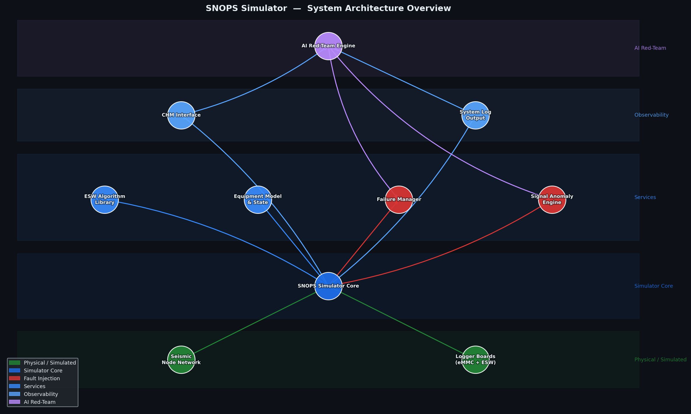
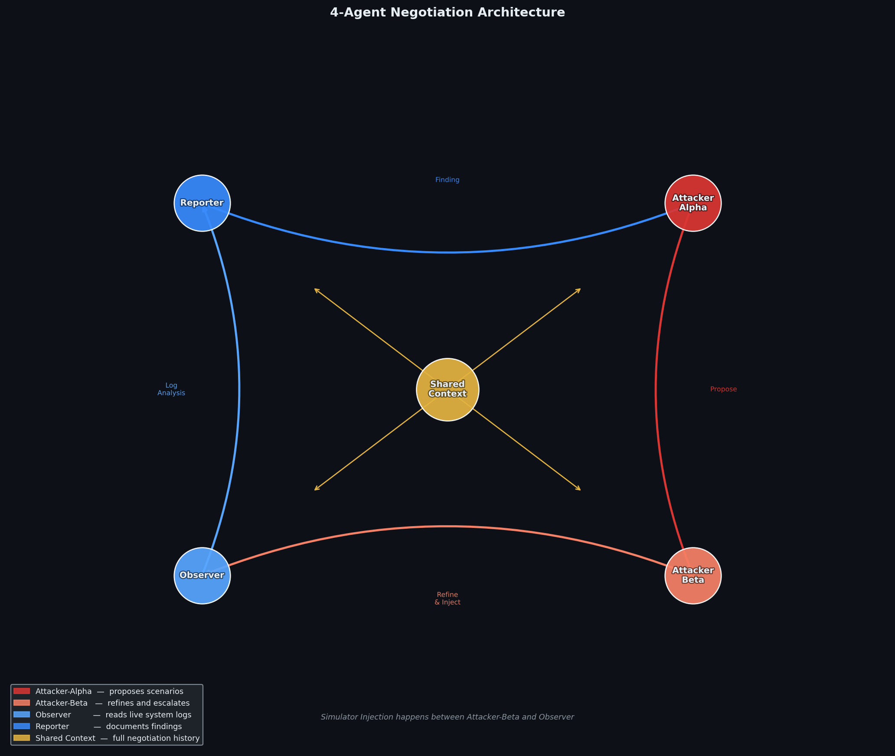
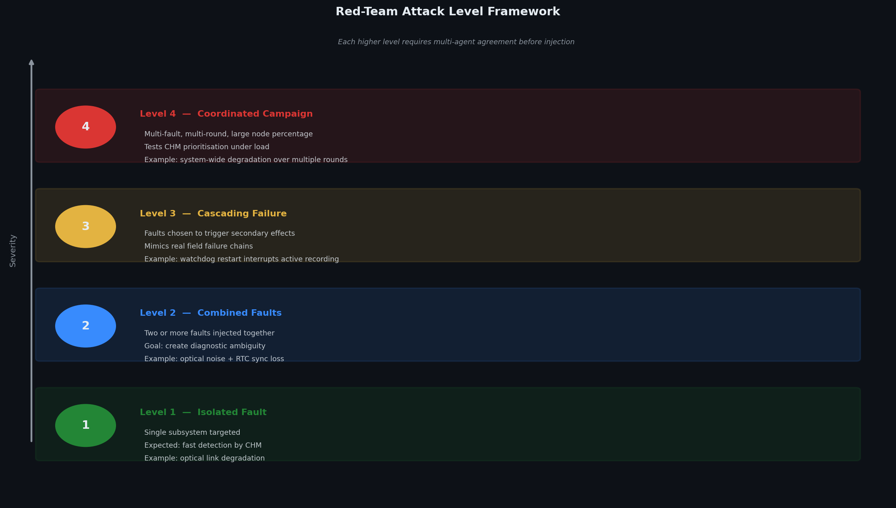

# SNOPS Simulator — Solution Architecture

**Solution Engineer:** Yassine Elhallaoui
**Date:** January 2026
**Document type:** High-level architecture overview

---

## 1. Purpose

This document describes the overall design of the SNOPS Simulator platform at a high level. It covers two main areas: how the system observes and interprets the state of a seismic acquisition network in real time, and how the autonomous AI red-teaming layer tests that network by generating and evaluating fault scenarios without human input.

The intended reader is a technical stakeholder who wants to understand how the pieces fit together, not the details of any individual component.

---

## 2. What the System Does

The SNOPS Simulator replicates a full seismic acquisition network in software. It models physical seismic nodes, the embedded firmware running on each node, the optical links connecting nodes to logger boards, and the health management interface that a field operator would use to monitor a real deployment.

The simulator serves two purposes. First, it gives QA teams a realistic environment for testing the network health monitor before new firmware or system software reaches the field. Second, through the AI red-teaming layer described below, it can run autonomous stress tests that probe the system for failure modes a human tester might not think to try.

---

## 3. System Architecture Overview

The architecture is organized in five layers, each building on the one below it.

**Physical and Simulated Layer**

At the base are the simulated seismic nodes and logger boards. Each logger holds a model of its embedded software state: eMMC storage usage, battery level, time synchronization status, firmware version, optical link quality, and a watchdog restart counter. This is the ground truth that everything else reads from.

**Simulator Core**

The simulator core maintains the full equipment model, drives the status publish cycle toward the health monitor interface, and coordinates all service layers above it. It also holds the embedded software algorithm library, compiled from actual firmware source, which ensures time arithmetic, seismic filter calculations, and fixed-point math all produce results identical to the real device.

**Service Layer**

Three services sit on top of the core. The equipment model manages the full network topology and per-node state. The failure manager handles live fault injection into running nodes. The signal anomaly engine configures synthetic seismic signal problems for the next recording session.

**Observability Layer**

The health monitor interface forwards the simulated node status to the real network health monitor, so it behaves exactly as it would against a live deployment. At the same time, all significant events are written to the system log, which feeds the AI red-team layer above.

**AI Red-Team Layer**

The topmost layer is the autonomous red-teaming engine. It reads from both the health monitor interface and the system log, generates fault scenarios, injects them into the running simulation, and evaluates the results. This layer is described in full detail in sections 5 and 6.

---

## 4. System Signal Observability

Before a fault can be evaluated, the system needs a reliable way to see what is happening across all nodes. This observability comes from two complementary sources.

The first is the real-time status stream sent to the health monitor interface. Each node publishes its full status every few seconds: logger state, battery voltage, eMMC error counters, optical link quality, RTC synchronization status, FIR filter configuration, and watchdog restart count. This gives a structured, per-field view of every node in the network at any moment.

The second is the raw system log. The simulator writes operational events to a rotating log file, and the system processes at the infrastructure layer write to their own logs under the standard log directory. The AI Observer agent reads both sources after each fault injection to detect effects that the structured status stream might not surface immediately, such as a transient warning that resolves before the next status publish cycle.

Together these two sources give the red-team system enough information to evaluate whether a fault was noticed, how fast the system responded, and whether the response was correct.

---

## 5. AI Red-Teaming Architecture

The AI red-teaming engine uses four agents that collaborate through a shared negotiation context. No agent acts on private information: every agent reads the full conversation history before contributing, so later rounds reflect what earlier rounds already discovered.

### The Four Agents

**Attacker-Alpha** opens each round by proposing a fault scenario. It decides which subsystems to target, which fault types to combine, and what percentage of nodes to affect. Its proposals are expressed as a structured object specifying each fault by name and parameter.

**Attacker-Beta** receives Alpha's proposal and the full conversation history. Its job is to make the scenario harder to diagnose. It might add a third fault type, increase severity, or swap one fault for a combination that produces more ambiguous log output. Beta's refined scenario is the one that gets injected into the simulator.

**Observer** waits for the system to react after injection, then reads the system logs and the node status stream. It reports what actually happened: which nodes were affected, which warnings appeared, and whether the system recovered or remained in a degraded state. It also flags anything unexpected that the scenario did not predict.

**Reporter** receives the full round context and writes a structured finding. This includes a summary of the scenario, a comparison of expected versus observed behavior, a severity rating, and concrete recommendations for the system or its monitoring layer.

### The Shared Context

All four agents share a single conversation transcript that accumulates across the full session. This is what makes it a negotiation rather than four independent processes. Attacker-Beta builds on Alpha's reasoning. Observer's report informs both where the next round should probe and what Reporter writes. Reporter's finding becomes background context that shapes Alpha's next proposal.

By the final rounds, the agents are exploring failure modes that were uncovered by earlier rounds, not just generating random scenarios. The session naturally progresses from simpler isolated faults to more targeted combinations.

---

## 6. Red-Team Attack Level Framework

Scenarios are organized into four levels of complexity. The level is not a configuration the operator sets: it emerges from the agents' negotiation as they push for harder scenarios in later rounds.

**Level 1 — Isolated Fault**

A single subsystem is targeted. The system is expected to detect and flag this quickly through the health monitor interface. Level 1 scenarios validate that basic fault detection is working and that the health monitor correctly identifies which nodes are affected.

**Level 2 — Combined Faults**

Two or more faults are injected simultaneously. The fault types are chosen so their symptoms overlap, making it harder to identify the root cause from the health monitor view alone. For example, optical link degradation combined with RTC sync loss produces a pattern where the health monitor cannot immediately distinguish a hardware failure from a timing problem.

**Level 3 — Cascading Failure**

Faults are selected because they trigger secondary effects. A watchdog reset interrupts an active recording and simultaneously increments multiple error counters, producing a signature that resembles both a software crash and a hardware fault. These scenarios test whether the health monitor can reason about cause and effect rather than just counting errors.

**Level 4 — Coordinated Campaign**

Multiple fault types are applied across a large fraction of the node network over several rounds. This simulates a system-wide degradation event, such as a firmware problem affecting all units in a particular revision group. The goal is to evaluate whether the health monitor can correctly prioritize its alerts when many nodes are reporting problems at the same time.

---

## 7. Negotiation Protocol and Round Flow

Within each round the agents follow a fixed sequence, but the content of every step depends on everything that came before it.

1. Attacker-Alpha reads the full conversation history and proposes a new scenario based on what has and has not been tried.
2. Attacker-Beta reads Alpha's proposal and the history, then returns a refined version.
3. The refined scenario is injected into the live simulator.
4. The system is given time to react.
5. Observer reads the system logs and node status, then reports actual behavior.
6. Reporter writes the structured finding for the round.
7. All six messages are appended to the shared context before the next round begins.

This structure means that each round's output directly shapes the next round's input. The session does not loop through preset scenarios: it discovers new ones based on what it has already learned.

---

## 8. Safety and Scope Controls

Three controls keep the autonomous testing within safe boundaries.

The first is a node percentage cap. The agents cannot target more than a configured percentage of active nodes in any single scenario. This prevents the red-team session from taking down enough nodes to make the simulation meaningless for concurrent manual testing.

The second is the scenario injection mechanism. Faults are applied through the same fault injection service used by human operators. This means the same limits and state checks that protect the manual interface also apply to the AI-generated scenarios.

The third is round gating. Each round requires agreement between Attacker-Alpha and Attacker-Beta before anything is injected. A scenario proposed by one agent that the other cannot meaningfully refine will be discarded in favor of a simpler fallback. The system never injects a scenario that the negotiation process did not produce.

---

## 9. Output and Reporting

At the end of each round the Reporter agent writes a structured finding. At the end of the full session it writes an executive summary covering all rounds, the most impactful scenarios found, an overall system resilience assessment, and the top recommendations for the engineering team.

All findings and the full negotiation transcript are available for export as a self-contained HTML report, which can be shared with the development team without requiring the simulator to be running.

---