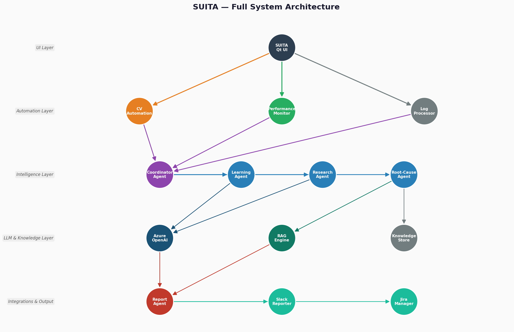
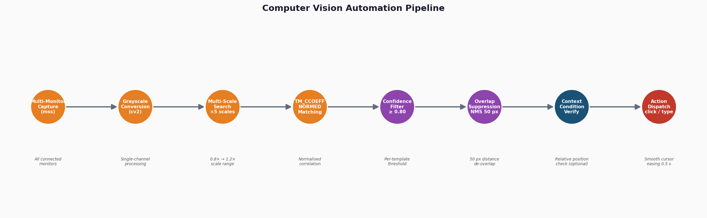
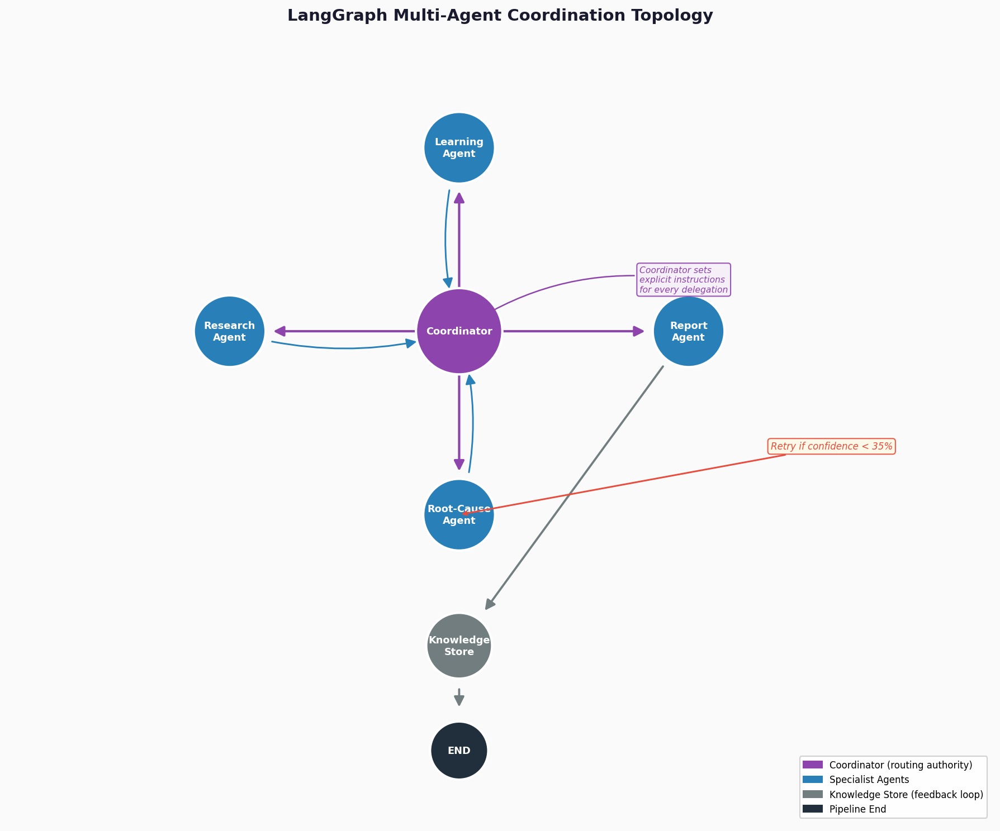
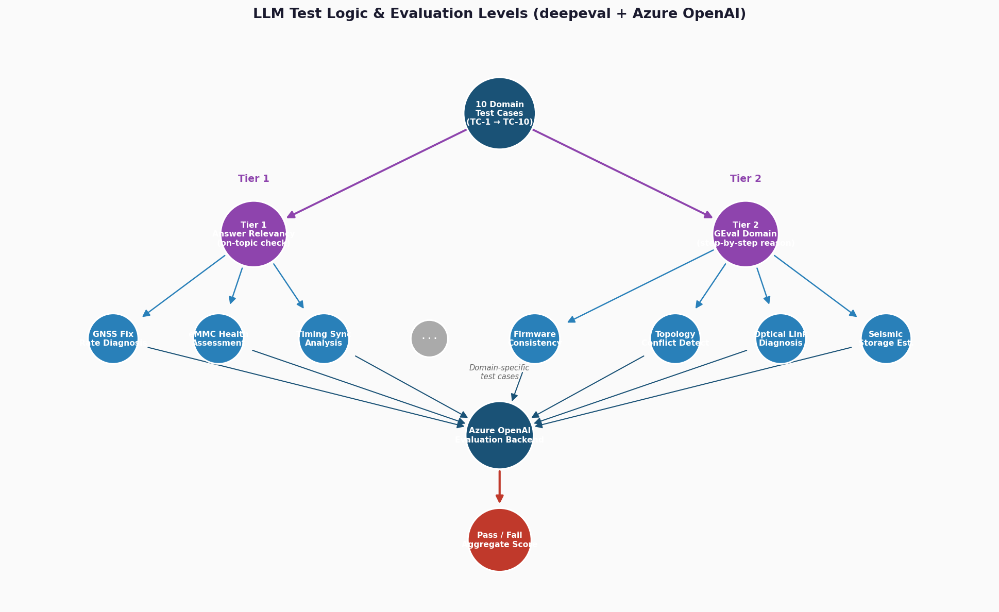
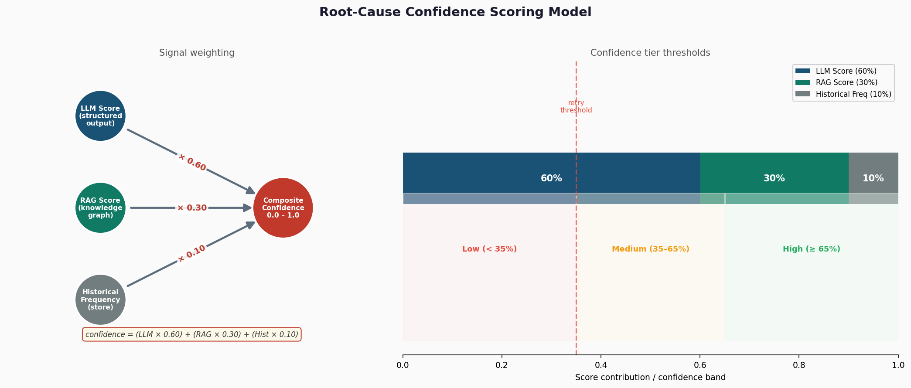

# SUITA: System Architecture Overview

**Stryde UI Integration Test Automation**

This document provides a high-level overview of the SUITA system design,
covering how it automates UI testing through computer vision, how it analyses
test results through a team of coordinating intelligent agents, and how it
validates the quality of its own AI reasoning through a layered evaluation model.

---

## 1. System Overview

SUITA is built in five layers that work together from user interaction down to
external reporting. Each layer has a clear, single responsibility, and data
flows in one direction, from collection upward through analysis and outward
toward reporting.

| Layer | What it does |
|---|---|
| User Interface | Manages projects, sequences tests, shows live dashboards, and displays final reports |
| Automation | Controls the application under test through screen recognition, collects system performance data, and gathers log files |
| Intelligence | A team of specialised agents that coordinate to analyse findings and reach a conclusion |
| Reasoning and Memory | The language model that powers each agent, alongside the knowledge base built from past test runs |
| Reporting and Integrations | Delivers structured reports, posts to team channels, and creates issue tickets |

As a test runs, raw evidence including logs, performance measurements and flag file
snapshots is continuously collected by the Automation layer. Once the run
completes, a coordination agent decides in what order and how many times to
call on the specialist agents, based on the quality of what they return rather
than a predetermined script.

---

## 2. Computer Vision Automation

Every action SUITA takes on the application under test, whether clicking a button,
entering text, or waiting for a screen state, is driven by image recognition.
The system never relies on application internals or accessibility APIs; it
sees the screen the same way a human tester would.

The pipeline moves through eight stages, each acting as a quality gate before
the next one begins.

| Stage | What happens |
|---|---|
| Screen capture | All connected monitors are captured at once in near real-time |
| Conversion | The captured frame is reduced to a single-channel representation to simplify comparison |
| Multi-scale search | The reference template is searched at five different zoom levels to handle varying display resolutions |
| Pattern matching | A normalised similarity score is computed at every position on the screen |
| Confidence filtering | Any match below the per-template threshold is discarded before anything is acted upon |
| Overlap removal | When several overlapping matches exist, only the single strongest one is kept |
| Context check | An optional spatial rule can require that the found element sits in a specific position relative to another element on screen |
| Action | The cursor moves to the target with smooth easing and the configured action is performed |

The confidence threshold and whether the context check applies are both
configured per template inside the project, so different parts of the user
interface can have different levels of strictness.

---

## 3. Intelligent Analysis System

Once a test run has finished, a team of agents analyses the collected evidence.
The design is built around coordination rather than a simple chain of steps.
That distinction matters in practice: a chain of steps runs the same sequence
regardless of the quality of the results at each stage. A coordinated team
reports back to a central authority after each task, and that authority decides
whether the result is good enough to move forward or whether further
investigation is warranted.

### The agents and their responsibilities

| Agent | Responsibility |
|---|---|
| Coordinator | The only entity that decides which agent acts next and what it should focus on. It reads the current state of the analysis and issues explicit instructions with each delegation |
| Learning Agent | Searches the historical memory of past test runs to surface patterns and failures that resemble the current situation |
| Research Agent | Takes the current test evidence and the historical context and identifies which known failure patterns apply, ranked by how closely they match |
| Root-Cause Agent | Works through the STRYDE source knowledge base and the research findings to identify the most likely location in the codebase where the problem originates, attaching a confidence score to each candidate |
| Report Agent | Takes all the findings from the other agents and produces a clear, structured report |
| Knowledge Store | Saves the outcome of every completed run so that future Learning Agent queries become more accurate over time |

### How coordination works in practice

The Coordinator starts by calling on the Learning Agent to understand what has
happened in the past with this project. It then sends the Research Agent to
compare the current evidence against those patterns. With those findings in
hand, it delegates to the Root-Cause Agent to produce ranked candidates.

At that point the Coordinator checks the confidence scores. If the top
candidate does not meet the acceptance threshold, the Coordinator does not
simply accept the result. Instead it sends the Research Agent back with a
broader brief to look for less obvious connections and consider cascading failures,
then calls the Root-Cause Agent a second time with the enriched context.
Only once the analysis is considered complete does the Coordinator send the
Report Agent to produce the final output.

Every agent receives an explicit written brief from the Coordinator describing
what to focus on for that particular call. Agents do not communicate with each
other directly; all coordination passes through that central authority.

---

## 4. Language Model Evaluation

SUITA includes a built-in quality test for the language model that powers its
agents. Ten test cases drawn from real STRYDE engineering scenarios are put to
the model, and the answers are assessed at two levels of rigour.

### The ten test scenarios

| Test | Area |
|---|---|
| TC-1 | GNSS fix rate diagnosis and field troubleshooting |
| TC-2 | Storage health assessment and deployment readiness |
| TC-3 | Timing synchronisation chain interpretation |
| TC-4 | Multi-node firmware and hardware revision compatibility |
| TC-5 | Seismic acquisition settings and signal sampling correctness |
| TC-6 | Sensor calibration parameter validation |
| TC-7 | Optical link quality and signal integrity distinction |
| TC-8 | Seismic data storage rate estimation |
| TC-9 | Firmware version consistency and mismatch risk |
| TC-10 | Node address conflict detection in topology |

### The two evaluation levels

**Level 1: Relevance check.** The first question asked is simply whether the
model's answer is on topic. A response that wanders outside the engineering
domain of the question fails at this level before any deeper assessment takes
place.

**Level 2: Domain reasoning check.** If the answer passes the relevance
check, it is then evaluated against a set of criteria specific to that test
case. This checks that the reasoning is not just plausible but technically
correct. For example, that a storage estimate uses the right data rate, or
that a timing diagnosis identifies the right component in the chain.

The operator selects how many test cases to run, from one to ten. Results are
reported as a pass or fail count. Both levels of evaluation run against the
same language model deployment that the agents use for analysis, so the test
reflects actual operational performance.

---

## 5. Root-Cause Confidence Scoring

When the Root-Cause Agent produces its list of candidates, each one carries a
composite confidence score. That score is not the opinion of a single source.
It is a weighted combination of three independent signals.

**Confidence = (Language model judgement x 60%) + (Knowledge base match x 30%) + (Historical recurrence x 10%)**

| Signal | Weight | What it reflects |
|---|---|---|
| Language model judgement | 60% | The agent's own assessment of how well each candidate explains the observed errors, given all the context it has received |
| Knowledge base match | 30% | How closely the candidate symbol or file matches the patterns extracted from the STRYDE source knowledge base across more than forty thousand indexed entries |
| Historical recurrence | 10% | How often this same location appeared as a confirmed root cause in previous test runs stored in the memory of the system |

### What happens at each confidence level

A score above 65% is considered high confidence and the analysis proceeds
directly to the report. A score between 35% and 65% is accepted but noted as
moderate confidence in the report. A score below 35% triggers the coordination
retry described in the previous section, where the Coordinator asks for deeper
research before accepting the result.

---

*June 2024, Yassine Elhallaoui*
