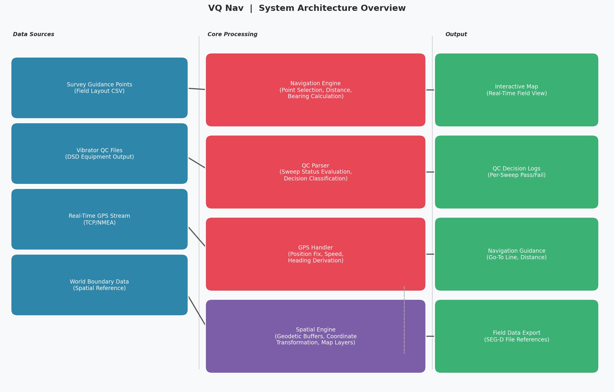
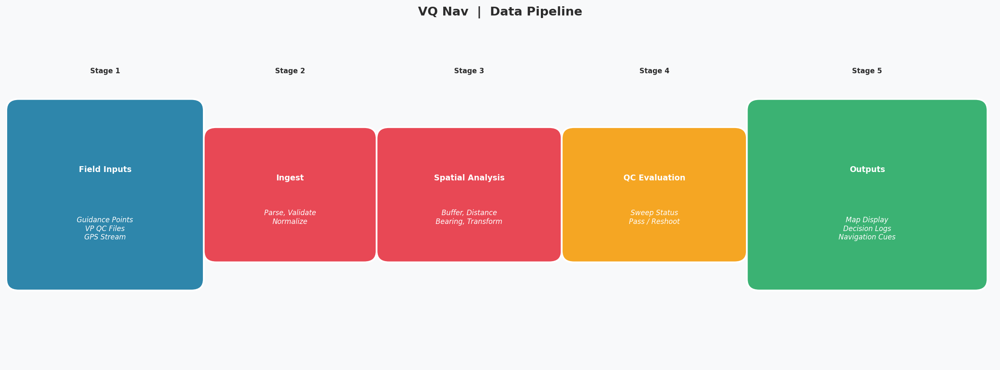
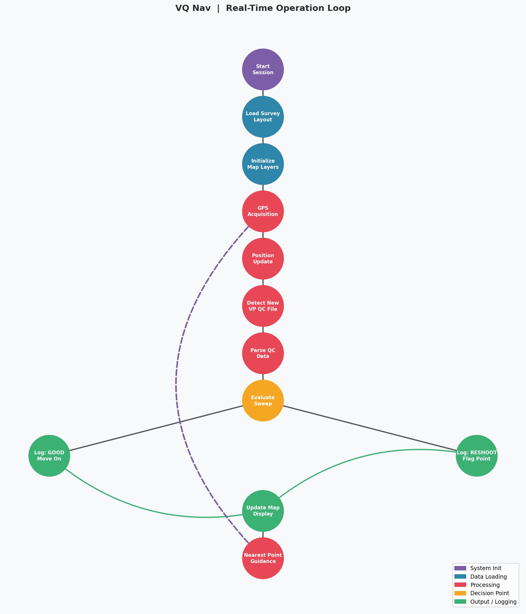

# VQ Nav: Seismic Field Navigation and Quality Control Platform

**Solution Engineer:** Yassine Elhallaoui  
**Date:** Oct 2024

---

## Overview

VQ Nav is a desktop platform built for seismic survey field operations. It gives field crews a live, map-based view of their survey progress, tracks vibrator equipment performance in real time, and flags when a shot point needs to be repeated. The goal is to reduce wasted field time by giving the crew clear, immediate answers: where to go next, and whether the last vibration sweep met quality standards.

---

## System Architecture

The platform is organized into three layers: the data coming in from the field, a processing core that makes sense of it, and a set of outputs the crew interacts with.

**Data Sources**

Four types of data feed the system continuously during a field session:

- Survey guidance points, which define the planned shot point layout across the survey area
- Vibrator QC files, produced automatically by each vibrator unit after every sweep
- A real-time GPS stream coming directly from the field GPS receiver
- A world spatial reference dataset used to ground the map display

**Core Processing**

The processing layer has four distinct responsibilities that run in parallel:

- **Navigation Engine** - Given the current GPS position, it calculates which survey points are nearby, how far away each one is, and what direction to travel to reach the selected target.
- **QC Parser** - When a new QC file arrives from a vibrator unit, it reads the sweep records, maps the status codes to human-readable outcomes, and decides whether each shot passed or needs to be redone.
- **GPS Handler** - It continuously reads the GPS stream, extracts a clean position fix, and derives the crew's current speed and heading.
- **Spatial Engine** - It handles the geometry work underneath everything else: converting coordinates between reference systems, drawing buffer zones around survey points, and keeping map layers current.

**Outputs**

Everything the crew sees and records flows from these three layers into four outputs:

- An interactive map showing their position, nearby points, and navigation guidance
- A running log of QC decisions for every sweep, organized by vibrator unit and date
- Real-time navigation cues pointing toward the next target
- References to the seismic data files that were produced at each shot point

---

## Data Pipeline

From the moment data enters the system to the moment a decision is logged, it passes through five stages:

| Stage | What Happens |
|-------|-------------|
| **1. Field Inputs** | Survey geometry, vibrator output files, and GPS positions arrive continuously from field equipment |
| **2. Ingest** | Raw data is read, validated, and put into a consistent internal format |
| **3. Spatial Analysis** | Coordinates are transformed, distances are measured, and buffer zones are drawn around each survey point |
| **4. QC Evaluation** | Sweep status codes are assessed and each shot is classified as a pass or a reshoot |
| **5. Outputs** | The map is updated, logs are written, and the crew gets updated navigation guidance |

Stages 3 through 5 run in near real time. The map and logs reflect the current state of operations with only a short lag from when the data is produced in the field.

---

## Real-Time Operation Loop

Once the session starts, the system runs a continuous loop for the duration of field operations:

**Startup (runs once)**

When the operator opens a new session, the system loads the survey layout and initializes all map layers before any live data starts flowing.

**The Live Loop (repeats continuously)**

1. The GPS handler pulls the latest position fix from the receiver.
2. The crew's position, speed, and heading are updated on the map.
3. The system checks for any new QC files that arrived from the vibrator units.
4. If a new file is found, the QC parser reads it and evaluates each sweep record.
5. Each sweep gets a decision: **Good** (the shot passed, the crew can move to the next point) or **Reshoot** (the shot failed, the crew stays and repeats it).
6. The result is written to the QC log and the map is refreshed.
7. The navigation guidance updates to show the distance and direction to the nearest pending survey point.
8. The loop returns to step 1.

The crew operates from this live loop for the entire working day. The map, the QC decisions, and the navigation guidance all update automatically without any manual refresh.

---

## Key Concepts

**Shot Point Navigation**

Survey points are pre-loaded from the field plan before operations begin. The navigation engine continuously ranks nearby points by proximity and draws a guidance line from the current position to the selected target. The crew can also manually select any point on the map to get directed navigation toward it.

**Vibrator Pattern Layout**

For each survey point, the system knows the spatial arrangement of all the vibrators in the crew's configuration. It draws the planned positions of each individual vibrator on the map, accounting for the spacing and geometry defined by the survey design. This gives the operator a clear picture of where each unit should be positioned before a sweep begins.

**QC Decision Logic**

After every sweep, the vibrator units produce a status code. The system maps these codes to one of two outcomes. A small set of status values indicate that the sweep data is clean and the crew can advance. Any other status triggers a reshoot flag. This mapping is transparent and traceable in the QC logs.

**USB Data Import**

Field units sometimes deliver QC files via USB drive. The system watches for drives as they are connected and picks up the data automatically, so the crew does not need to manage file transfers manually.

---

## Summary

VQ Nav removes the ambiguity that typically slows down seismic field operations. The crew always knows where they are on the survey grid, whether their last shot was acceptable, and which point to head to next. All of this information updates automatically from the data the field equipment already produces, without adding extra steps to the crew's workflow.

---
